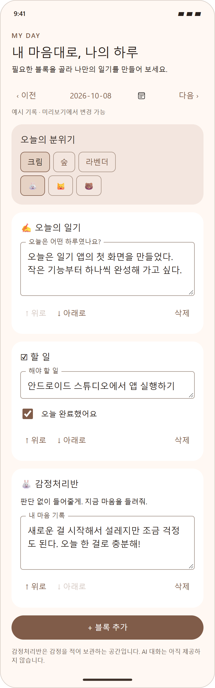

# 마이데이 (MyDay)

[](https://github.com/parkhookjung-debug/myday-diary/actions/workflows/android.yml)
[](LICENSE)

갤럭시에서 실행하는 커스터마이즈 일기 앱의 첫 프로토타입입니다.
Kotlin + Jetpack Compose로 구현했습니다.

MIT 라이선스로 공개하는 오픈소스 프로젝트입니다.
팀 작업은 이슈 → 작업 브랜치 → PR → 리뷰 → 병합 순서로 진행합니다.
개발 참여 방법과 5명 팀의 담당 영역 제안은 [기여 안내](CONTRIBUTING.md)를 참고하세요.
디자인 파일의 수정 위치와 Android Studio 미리보기 방법은 [팀 디자인 적용 안내](docs/DESIGN.md)를 참고하세요.

## 저장소 받기

```sh
git clone https://github.com/parkhookjung-debug/myday-diary.git
cd myday-diary
```

Android Studio에서 clone한 `myday-diary` 폴더를 엽니다.
`main`은 함께 사용하는 기준 브랜치입니다.
GitHub Actions는 push와 PR에서 APK 빌드·Android Lint·등록된 단위 테스트를 실행합니다.
성공한 실행의 Artifacts에서 디버그 APK를 받을 수 있습니다. 저장·날짜 이동 관련 단위 테스트를 포함합니다.

## 예시 화면

아래 이미지는 초기 일기 화면을 재현한 예시입니다. 실제 갤럭시 캡처가 아니며, 이후 추가한 위젯·라이브 배경화면 설정은 포함하지 않습니다.



## 현재 기능

- 날짜 선택 및 날짜별 기록
- 글 일기, 할 일, 습관 체크, 감정처리반 블록 추가
- 블록 순서 변경 및 삭제 확인
- 배경 테마 3종과 캐릭터 3종 선택
- 휴대폰 내부 자동 저장 및 저장 실패 시 재시도
- 홈 화면 위젯: 오늘의 할 일·습관 완료 수, 캐릭터 응원 문구, 일기 앱 열기
- 라이브 배경화면: 떠다니는 캐릭터, 벽에서 방향 전환, 드래그 이동, 탭하면 하트 반응

감정처리반은 캐릭터에게 감정을 적는 기록 기능입니다. AI 응답은 없습니다.
사진, 영상, 일기 블록의 자유로운 크기 조절, 계정 및 동기화는 후속 기능입니다.
습관 체크는 날짜별 체크 기능이며 누적 통계는 아직 없습니다.
앱을 삭제하거나 앱 데이터를 지우면 기록이 사라집니다.

## Android Studio에서 실행

1. Android Studio의 **Open**으로 이 README가 있는 프로젝트 폴더를 엽니다.
2. Gradle Sync가 끝날 때까지 기다립니다. 처음에는 인터넷 연결이 필요합니다.
3. SDK Manager에서 Android API 35를 설치합니다.
4. Gradle JDK는 Android Studio에 포함된 JDK(17 이상)를 선택합니다.
5. 갤럭시에서 설정 → 휴대전화 정보 → 소프트웨어 정보 → 빌드번호를 7회 눌러 개발자 옵션을 켭니다.
6. 개발자 옵션에서 USB 디버깅을 켜고 PC와 연결합니다. 휴대폰의 디버깅 허용 메시지를 승인합니다.
7. Android Studio 상단에서 연결된 갤럭시와 `app`을 선택하고 ▶ Run을 누릅니다.

Android 8.0 이상에서 실행됩니다. 연결된 기기가 없으면 에뮬레이터로 실행할 수 있습니다.

## 직접 확인할 흐름

1. 글·할 일·습관·감정 블록을 각각 추가합니다.
2. 내용을 입력하고 체크박스를 선택한 뒤 순서를 변경합니다.
3. 날짜를 이동했다가 돌아와 내용이 유지되는지 확인합니다.
4. 앱을 종료하고 다시 실행해 기록이 유지되는지 확인합니다.
5. 테마와 캐릭터가 날짜별로 저장되는지 확인합니다.
6. 삭제 창에서 취소하면 내용이 유지되고, 삭제하면 해당 블록만 없어지는지 확인합니다.

## 홈 화면 위젯과 움직이는 캐릭터

앱의 **홈 화면의 작은 친구**에서 각각 설정합니다.

- **홈 화면에 일기 위젯 추가**: 시스템 추가 창에서 확인합니다. 지원되지 않으면 갤럭시 홈 화면을 길게 누르고 위젯 → 마이데이를 선택합니다.
- **움직이는 캐릭터 배경화면 설정**: Android 라이브 배경화면 미리보기가 열립니다. 배경화면 적용을 직접 확정합니다. 기존 배경화면을 대체하므로 확인 후 적용하세요.
- 홈 화면 캐릭터는 토끼·고양이·곰 이모지로 만든 첫 프로토타입입니다. 오늘 날짜에서 선택한 캐릭터와 테마를 사용합니다.
- 캐릭터가 화면 경계에서 방향을 바꾸며 이동합니다. 캐릭터를 끌어 이동하고, 누르면 잠깐 하트가 나타납니다. 터치 전달 여부는 홈 런처에 따라 달라질 수 있습니다.
- 다른 앱을 열거나 화면을 꺼 배경화면이 보이지 않으면 애니메이션 루프를 중지합니다. 배경화면이 보이는 동안 최대 약 30fps로 그립니다.
- 홈 위젯은 연속 애니메이션 대신 캐릭터를 누르면 응원 문구가 바뀝니다. 오늘의 할 일·습관 체크와 테마·캐릭터 변경은 저장 직후 반영합니다.
- 자정 이후 위젯 날짜는 시스템의 주기 갱신 시 반영합니다(30분 주기 요청, 실제 시간은 시스템에 따라 지연 가능). 위젯 캐릭터를 누르면 즉시 오늘 날짜로 갱신합니다.
- 배경화면은 오늘 기록의 캐릭터와 테마를 3초마다 다시 읽습니다. 새 날짜에 기록이 없으면 기본 토끼·크림 테마입니다.
- 위젯에는 개인 일기나 감정의 본문을 노출하지 않습니다.

확인 순서: 오늘 날짜에서 캐릭터/테마 변경 → 위젯 추가 → 체크 수 반영 확인 → 위젯 캐릭터 탭 → 일기 열기 → 라이브 배경화면 적용 → 캐릭터 이동/드래그/탭 확인 → 앱 실행 후 다시 홈으로 돌아오기.

## 빌드 및 검증

2026-10-08에 홈 위젯과 라이브 배경화면을 추가한 v0.2.0의 `:app:assembleDebug` 빌드가 성공했습니다.
`:app:lintDebug` Android 정적 검사도 통과했습니다.
APK 경로는 `app/build/outputs/apk/debug/app-debug.apk`입니다.
실제 갤럭시 및 에뮬레이터에서의 화면·터치·저장 동작은 아직 검증하지 않았습니다.
Windows Gradle 캐시의 임시 폴더 이동 오류가 발생해 로컬 생성 캐시를 복구하고 빌드했습니다.
한글 폴더 경로 때문에 `android.overridePathCheck=true`를 적용했습니다.

- AGP/Gradle 호환성: https://developer.android.com/build/releases/agp-8-9-0-release-notes
- Compose 컴파일러 설정: https://developer.android.com/develop/ui/compose/setup-compose-dependencies-and-compiler
- 홈 위젯: https://developer.android.com/develop/ui/views/appwidgets
- 라이브 배경화면 수명주기·터치: https://developer.android.com/reference/android/service/wallpaper/WallpaperService.Engine
