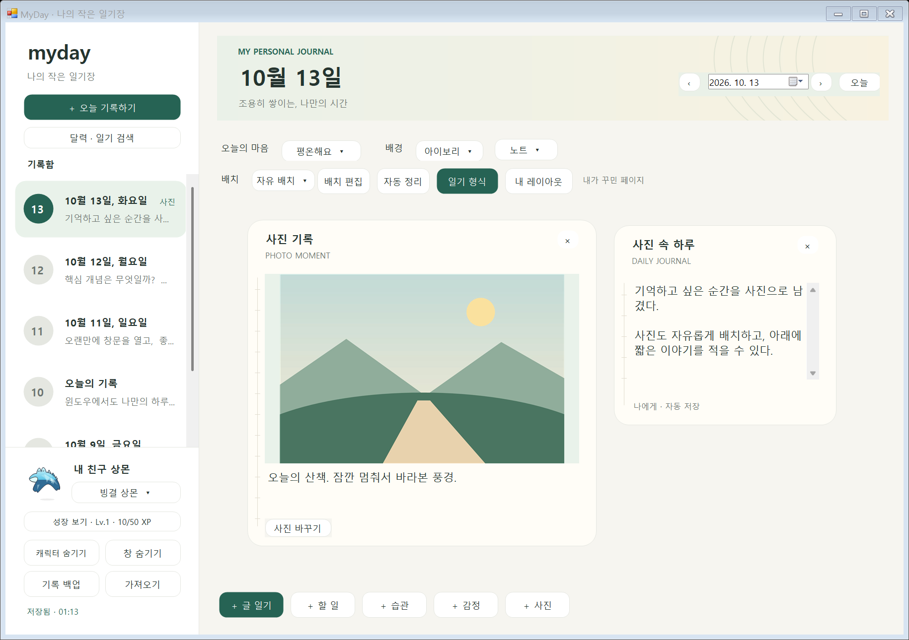
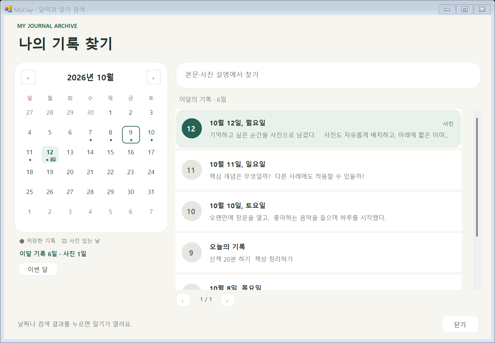
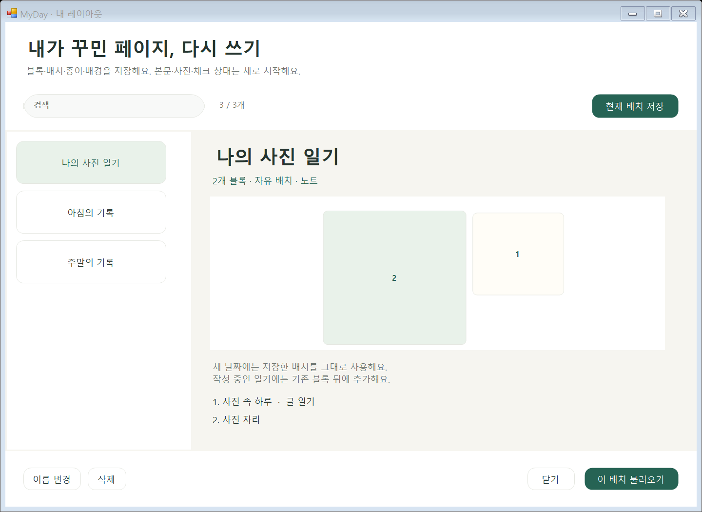
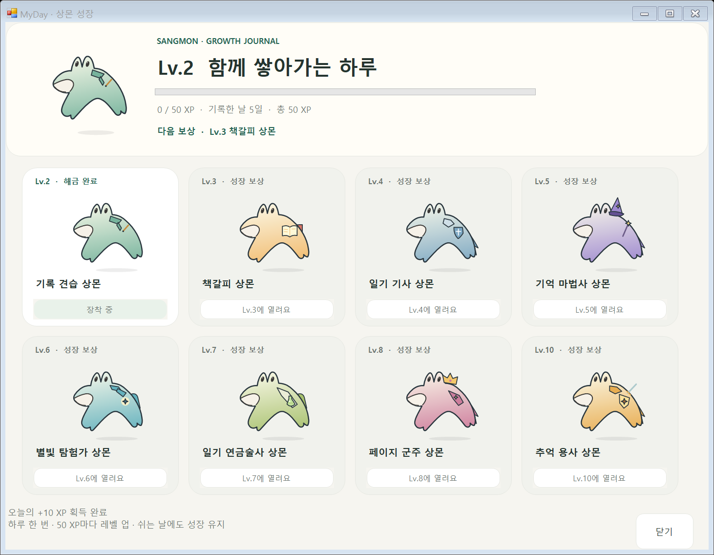

# 마이데이 (MyDay)

[](https://github.com/parkhookjung-debug/myday-diary/actions/workflows/android.yml)
[](https://github.com/parkhookjung-debug/myday-diary/actions/workflows/windows.yml)
[](LICENSE)

갤럭시와 Windows에서 사용하는 커스터마이즈 일기 앱입니다. 글·할 일·습관·감정을 기록하고 나만의 레이아웃을 구성합니다. Windows에서는 상몬이 바탕화면을 돌아다니며, 한 번 클릭하면 일기 창을 엽니다.

MIT 라이선스의 오픈소스 프로젝트입니다. 5명이 UI·저장·캐릭터·통합·검증을 나눠 작업할 수 있도록 기능과 디자인 파일을 분리했습니다.

현재 최신 통합 작업은 [codex/windows-app 브랜치](https://github.com/parkhookjung-debug/myday-diary/tree/codex/windows-app)와 [통합 PR #7](https://github.com/parkhookjung-debug/myday-diary/pull/7)에 있습니다. `main` 반영에는 팀원 1명의 리뷰 승인이 필요합니다.

## 실행하기

| 플랫폼 | 실행 방법 | 자세한 안내 |
| --- | --- | --- |
| Windows 10/11 | 소스의 `windows/실행.cmd`를 더블클릭하거나 배포 ZIP에서 `MyDay.exe` 실행 | [Windows 실행·개발 안내](windows/README.md) |
| Android 8 이상 | Android Studio에서 저장소 루트를 열고 `app` 실행 또는 배포 APK 설치 | [Android 실행·기능 안내](docs/ANDROID.md) |

Windows의 상몬 성장·내 레이아웃 저장·월간 달력·본문/사진 설명 검색·사진 첨부·일기 형식 100종·자유 배치를 포함한 ZIP은 [v0.3.8-preview](https://github.com/parkhookjung-debug/myday-diary/releases/tag/v0.3.8-preview), Android APK는 [v0.3.0-preview](https://github.com/parkhookjung-debug/myday-diary/releases/tag/v0.3.0-preview)에서 받습니다. APK는 개발용 debug 빌드입니다.

```sh
git clone https://github.com/parkhookjung-debug/myday-diary.git
cd myday-diary
# 통합 PR이 main에 반영되기 전에는 최신 작업 브랜치를 사용합니다.
git switch codex/windows-app
```

Windows 소스 실행에는 .NET Framework 4.8 이상이 필요합니다. Android 개발에는 JDK 17 이상과 Android SDK 35가 필요합니다.

## 파일 찾기

| 폴더 | 내용 |
| --- | --- |
| `app/` | Android 화면·저장·위젯·라이브 배경화면·테스트 |
| `windows/Core/` | Windows 일기 모델·저장·클릭/드래그 구분 |
| `windows/UI/` | Windows 일기 화면·블록·디자인 |
| `windows/Character/` | 상몬 그림·외형·게임 스타일·움직임·투명 창 |
| `docs/` | 플랫폼 실행 안내·디자인 기준·팀 역할·저장소 구조 |
| `previews/android/` | Android 및 초기 화면의 PNG·GIF·HTML 예시 |
| `previews/windows/` | Windows 화면·상몬·게임 스타일 PNG·GIF |
| `.github/` | 플랫폼별 자동 검사·이슈와 PR 양식 |

전체 구조와 기능별 수정 파일은 [파일·폴더 안내](docs/REPOSITORY-STRUCTURE.md), 자료 설명은 [미리보기 안내](previews/README.md)에 정리했습니다.

## Windows와 상몬

- 날짜별 기록·본문 미리보기, 아이보리 종이와 청록색 포인트. [Windows 디자인 수정 안내](docs/WINDOWS-DESIGN.md)
- [월간 달력·일기 검색](docs/CALENDAR-SEARCH.md): 기록한 날·사진 있는 날 표시, 본문과 사진 설명 검색, 결과 클릭으로 일기 열기. 왼쪽 버튼 또는 Ctrl+F로 실행
- [일기 형식 100종](docs/JOURNAL-FORMATS.md): 10개 분야별 10종, 제목·질문·배치 이름 검색, 질문·배치 미리보기와 날짜별 저장. [전체 목록·참고 출처](docs/JOURNAL-CATALOG.md)
- 긴 글·질문 카드·본문+메모·타임라인·편지·플래너·코넬 노트·비교형 등 8종 배치
- 날짜별 일기·할 일·습관·감정, 블록 순서·너비 변경, 자동 저장과 JSON 백업
- [사진 첨부](docs/PHOTOS.md): 사진과 설명·날짜별 자유 배치, 사진 교체, 사진을 포함하는 JSON 백업·복원
- [자유 배치](docs/FREE-LAYOUT.md): 블록 제목을 드래그해서 이동하고 모서리로 크기를 조절하며 날짜별 위치·크기를 저장
- [내 레이아웃](docs/MY-LAYOUTS.md): 직접 꾸민 구성을 이름 붙여 저장·미리보기·검색·이름 변경·삭제하고 다른 날짜에 빈 블록과 사진 자리로 재사용. 백업에 함께 보관
- 바탕화면 이동·클릭으로 일기 열기·드래그·숨기기·다시 표시
- 기존 외형 48종과 RPG 속성 스타일 8종은 자유 선택, 성장 보상 8종을 더해 총 64종
- [상몬 성장](docs/SANGMON-GROWTH.md): 실제 기록일마다 +10 XP, 50 XP마다 레벨 업, 보상 외형 미리보기·해금·장착, 백업에 성장 기록 포함
- 화염·빙결·전격·맹독·그림자·암석·해류·비전은 몸 색·명암·재질·효과로 구분
- 불 뿜기는 터치와 드문 하품에만 잠깐 표시

캐릭터를 숨긴 뒤에는 알림 영역 MyDay 아이콘을 더블클릭해 일기를 열고 왼쪽 표시 버튼을 사용합니다. 캐릭터 우클릭의 **게임 스타일**에서 RPG 외형을 바로 고를 수 있습니다.











## Android

날짜별 일기·블록 편집·자동 저장, 홈 화면 위젯, 움직이는 캐릭터 라이브 배경화면을 제공합니다. Android의 캐릭터 구성과 동작은 Windows와 다르며, Windows의 64종 외형과 성장 기능을 Android에 모두 적용한 상태는 아닙니다.


## 공동 작업

- [개발 참여·PR·검증](CONTRIBUTING.md)
- [5명 팀 역할과 담당 파일](docs/TEAM.md)
- [Android 디자인 수정](docs/DESIGN.md)
- [상몬 디자인·게임 스타일 수정](docs/SANGMON-DESIGN.md)

Android CI는 APK 빌드·Lint·단위 테스트를, Windows CI는 C# 빌드·저장·레이아웃·사진·달력·검색·캐릭터 테스트를 실행합니다. Windows의 자동 테스트는 114개이며 네이티브 화면 흐름은 격리된 예시 데이터로 별도 확인했습니다. 갤럭시 실기기, 여러 모니터·DPI·절전 복귀 확인은 추가 검증 대상입니다.

일기는 각 기기에 저장합니다. 사진 첨부는 Windows에서 지원합니다. Android와 Windows 사이의 자동 동기화, Android 사진 첨부, 영상 첨부, AI 감정 대화는 후속 기능입니다.
