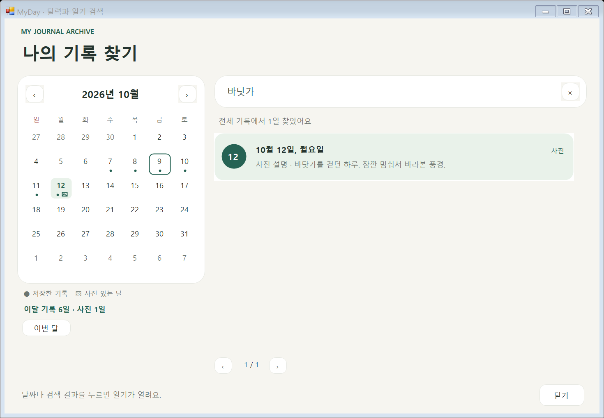

# Windows 달력과 일기 검색

일기 왼쪽 **달력 · 일기 검색**을 누르면 월간 달력과 기록 목록이 함께 열립니다. 일기 창에서 **Ctrl+F**로도 열 수 있습니다. 입력 중인 내용은 먼저 저장하며, 저장이 실패하면 현재 일기에 머뭅니다.

## 달력으로 찾기

- ‹ / ›로 이전·다음 달을 보고 **이번 달**로 돌아옵니다.
- **점**은 저장한 기록, **작은 사진 표시**는 사진을 첨부한 날입니다. 오늘은 테두리, 현재 열려 있는 날짜는 배경색으로 구분합니다.
- 아래에 이달의 기록 일수와 사진이 있는 일수를 표시합니다.
- 날짜를 누르면 해당 일기를 엽니다. 빈 날짜도 선택할 수 있고, 내용을 작성하면 새로운 기록으로 저장합니다.
- 검색어가 비어 있으면 오른쪽에 현재 달의 저장된 기록을 최신순으로 보여줍니다. 명시적으로 저장한 빈 일기도 목록·달력에 표시합니다.

## 내용으로 찾기

검색칸에 단어를 입력하면 **모든 날짜**에서 찾아줍니다. 화면의 달을 바꿔도 검색은 전체 기록을 대상으로 합니다.

- 일기 본문·사진 설명·할 일·습관·감정 블록에 사용자가 입력한 글을 검색합니다.
- 영문 대소문자는 구분하지 않고 검색어 양 끝의 공백을 무시합니다. 입력한 문구가 포함된 글을 찾습니다.
- 질문·템플릿 제목과 이미지 데이터는 검색 대상에서 제외합니다.
- 결과에는 날짜·일치하는 부분의 짧은 미리보기·사진 유무를 표시합니다. 사진 설명에서 찾은 결과에는 **사진 설명**을 붙입니다.
- 결과를 누르면 해당 날짜의 일기를 엽니다. 한 날짜에 여러 블록이 일치해도 날짜는 한 번만 나옵니다.
- 결과는 최신순이며 한 페이지에 최대 50일씩 표시합니다. ‹ / ›로 나머지 결과를 봅니다.
- × 또는 검색칸의 **Esc**로 검색어를 지웁니다. 검색어가 없을 때 Esc 또는 **닫기**는 원래 일기로 돌아갑니다.
- **Enter**는 검색을 바로 실행합니다. 결과를 열려면 원하는 날짜를 클릭하거나 키보드로 해당 결과 버튼을 선택합니다.

입력 후 250ms에 검색하고, 작성된 기록을 직접 읽어 수정 내용도 반영합니다. 검색·월 이동은 기록을 수정하지 않습니다. 별도 검색 데이터나 저장 형식 변경 없이 기존 JSON 기록과 사진 백업을 그대로 사용합니다.

## 수정할 파일

| 영역 | 파일 |
| --- | --- |
| 달력 날짜·기록/사진 표시·검색·미리보기 | `windows/Core/DiaryBrowse.cs` |
| 검색 창·검색칸·결과·페이지 이동 | `windows/UI/JournalBrowser.cs` |
| 월간 달력·날짜 버튼·월 이동 | `windows/UI/MonthCalendar.cs` |
| 날짜 결과 행·사진 표시 | `windows/UI/HistoryRow.cs` |
| 일기 화면 연결·저장 후 날짜 이동 | `windows/UI/DiaryWindow.cs` |
| 윤년·경계·검색·기록 보존 테스트 | `windows/BrowseTests.cs` |
| 실제 Windows 검색 화면 검증 | `windows/UI/JournalBrowserVerification.cs` |

달력과 검색은 현재 Windows에 적용했습니다.

화면에는 격리된 예시 기록을 사용했습니다. 개인 일기·사진은 저장소에 포함하지 않습니다.
