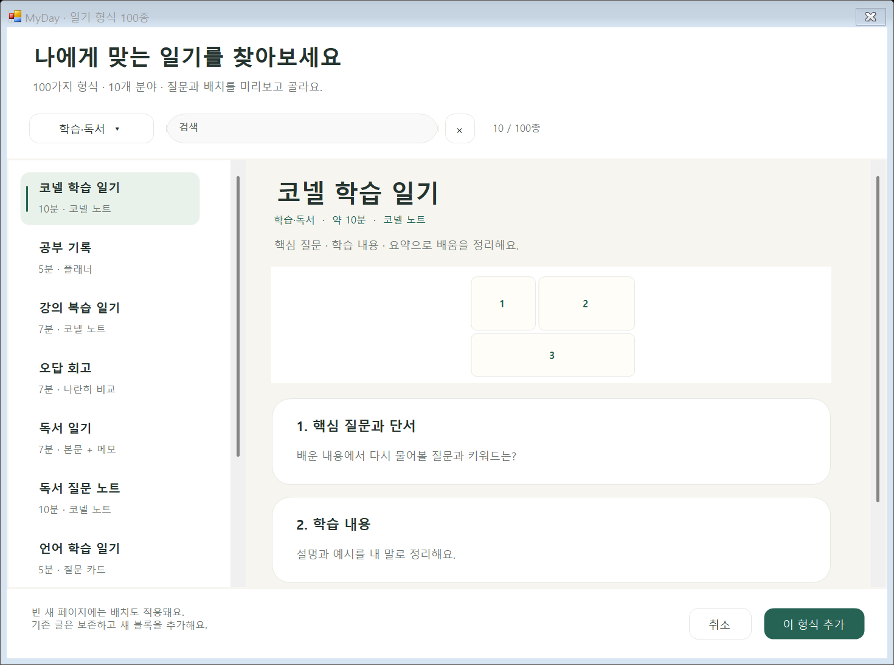
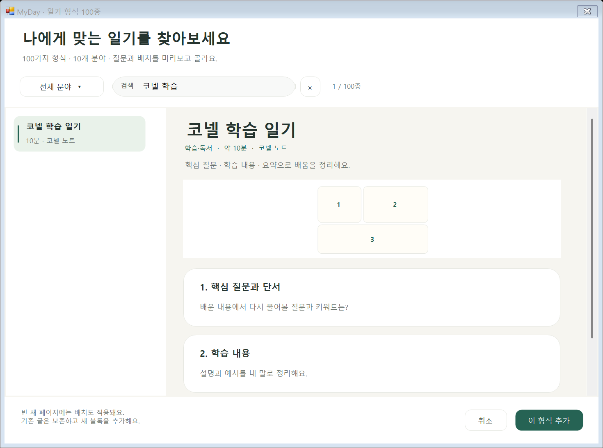
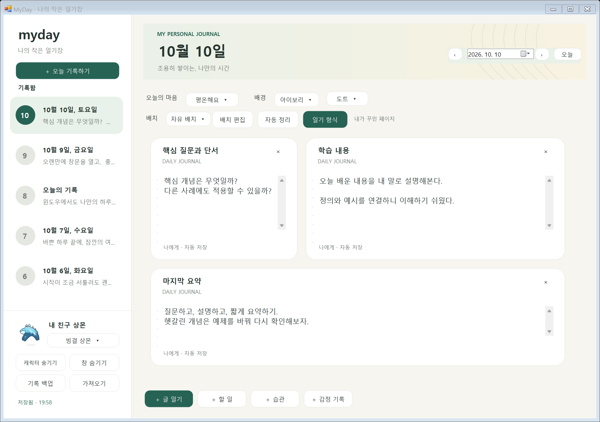

# 일기장 형식

Windows 일기 위쪽 **일기 형식**을 누르면 **100종**을 고를 수 있습니다. 분야를 선택하거나 제목·질문·배치 이름을 검색하고, 미리보기를 확인한 뒤 **이 형식 추가**를 누릅니다. Ctrl+F로 검색칸을 선택합니다. 배경 선택 옆에서는 **노트·카드·도트** 표면을 따로 바꿉니다.

| 분야 | 수 | 예시 |
| --- | --- | --- |
| 일상 기록 | 10 | 한 줄, 세 줄, 모닝 페이지, 하루 타임라인 |
| 회고·성장 | 10 | 깁스 6단계, 주간·월간 회고, 유지·바꾸기 |
| 감사·행복 | 10 | 세 가지 감사, 나에게 감사, 감사 편지 |
| 마음 정리 | 10 | 감정 체크인, 걱정 분류, 에너지 지도 |
| 학습·독서 | 10 | 코넬 학습, 강의 복습, 오답 회고, 독서 |
| 목표·계획 | 10 | 하루·주간 계획, 목표 쪼개기, 프로젝트 |
| 생활·루틴 | 10 | 습관, 수면, 식사, 산책, 디지털 휴식 |
| 관계·편지 | 10 | 상몬에게 편지, 미래의 나, 친구·가족 |
| 창작·취향 | 10 | 아이디어, 꿈, 음악·영화·전시 감상 |
| 여행·추억 | 10 | 여행 준비·회고, 생일, 계절, 연말 |

[전체 100종의 구성과 참고 자료](JOURNAL-CATALOG.md)를 확인할 수 있습니다. 기존 6종도 유지하고 94종을 더했습니다. 각 형식은 고유한 제목·질문 조합이며, 대략적인 작성 시간과 블록 배치를 미리 보여줍니다.

배치는 **긴 글·질문 카드·본문+메모·타임라인·편지·플래너·코넬 노트·나란히 비교** 8종입니다. 좁은 캔버스에서는 최소 크기를 지키며 세로로 배치합니다.

기존 글·체크·자유 배치는 보존하고 새로운 블록을 추가합니다. 저장하지 않은 새 날짜의 기본 빈 글 칸은 첫 선택 시 교체하며, 빈 페이지에는 형식별 배치를 적용하고 자유 배치로 전환합니다. 기존 자유 배치에서는 형식의 블록들을 원래 블록 아래에 배치합니다. 자동 정렬 페이지에는 새 블록을 추가합니다. 제목 드래그·↘ 크기 조절로 다시 꾸밀 수 있습니다. 블록 한도 200개를 넘으면 일부만 추가하지 않고 전체 추가를 취소합니다.

안내 질문은 빈 입력칸의 도움말로 표시됩니다. 글을 쓰기 시작하면 사라지며 답변란에 질문이 자동 입력되지 않습니다. 형식의 제목·질문과 종이 스타일은 날짜별로 저장하고 JSON 백업에 포함합니다. 형식 선택은 원래 기분·배경·상몬 선택을 바꾸지 않습니다.

새 날짜는 넓은 글 일기 한 칸으로 시작합니다. 이전 저장본에는 템플릿 필드가 없어도 기존 글·블록·체크·배치를 그대로 읽습니다. 상몬에게 편지는 로컬 감정 기록이며 AI 답변은 제공하지 않습니다.

팀 수정: 기존 6종은 `windows/Core/DiaryTemplates.cs`, 추가 형식은 `windows/Core/Templates/`의 분야별 파일에서 바꿉니다. `JournalLayouts.cs`는 배치, `TemplateGallery.cs`는 검색·분야·선택 화면, `TemplateOption.cs`는 목록과 배치 그림입니다. 모델 선택 필드는 `PageStyle`, `DiaryBlock.Title`, `DiaryBlock.Prompt`이며 저장 검증은 `windows/Core/DiaryData.cs`에 있습니다.

웹 자료의 주제·구조를 참고하고 한국어 질문은 프로젝트에서 새로 작성했습니다. [Day One](https://dayoneapp.com/guides/tips-and-tutorials/templates/), [Journey](https://journey.cloud/types-of-diary), [Bullet Journal](https://bulletjournal.com/blogs/faq/collections), [에든버러대 회고 모델](https://reflection.ed.ac.uk/reflectors-toolkit/reflecting-on-experience/gibbs-reflective-cycle), [코넬대 노트](https://lsc.cornell.edu/how-to-study/taking-notes/cornell-note-taking-system/) 등을 참고했습니다. 개별 형식의 참고 링크는 전체 목록에 있습니다.

