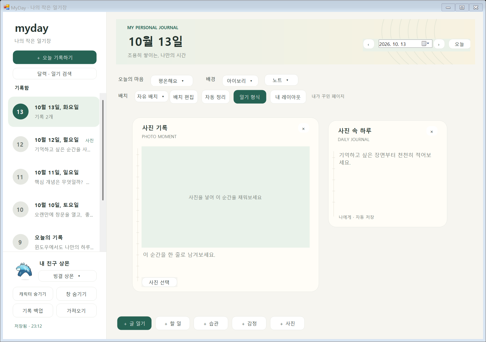

# Windows 내 레이아웃

직접 꾸민 페이지를 저장해 다른 날짜에 다시 사용할 수 있습니다. 기본 일기 형식 100종과 별도로 **내 레이아웃**에서 관리합니다.

## 저장하기

1. 일기에 원하는 블록을 추가합니다. **배치 편집**에서 제목으로 이동하고 ↘로 크기를 바꾼 뒤 **편집 완료**를 누릅니다.
2. 위쪽 **내 레이아웃 → 현재 배치 저장**을 누릅니다.
3. 이름을 1~40자로 입력하고 **저장**을 누릅니다.

블록 종류·순서·제목·질문·너비 설정·크기·배치 방식·종이 스타일·배경을 저장합니다. 자유 배치는 논리 좌표를 그대로 저장하고, 자동 정렬은 불러온 창의 폭에 맞춥니다. 본문·사진 설명·실제 사진·완료 체크·오늘의 기분은 복사하지 않습니다. 사진 블록은 **빈 사진 자리**로 저장합니다.

## 다시 사용하기

1. 사용할 날짜를 선택하고 **내 레이아웃**을 엽니다.
2. 목록이나 이름 검색으로 저장한 배치를 찾고 오른쪽에서 배치와 블록 구성을 미리봅니다.
3. **이 배치 불러오기**를 누릅니다.

새 페이지에는 저장한 배경·종이·배치 방식과 블록 구성을 적용합니다. 기본 빈 글 칸은 교체하고 글·체크는 새로 시작합니다. 기존 일기에는 원래 기록·사진·체크·배경·종이를 보존하고 새 블록을 뒤에 추가합니다. 기존 자유 배치에는 가장 아래 블록보다 아래에 저장한 구성을 추가합니다. 기존 자동 정렬에서는 순서대로 정렬합니다.

빈 사진 자리의 **사진 선택**으로 새 사진을 넣습니다. 사진을 넣어도 미리 적은 설명과 위치·크기는 유지합니다. 달력의 사진 표시에는 실제 사진을 넣은 날짜가 반영됩니다.

## 관리와 백업

- **이름 변경**으로 이름을 수정하고 **삭제**로 저장한 배치를 정리합니다. 이미 작성한 날짜별 일기는 유지합니다.
- 최대 50개의 레이아웃을 저장합니다. 한 레이아웃과 한 날짜는 각각 최대 200개 블록입니다. 같은 이름은 영문 대소문자를 구분하지 않고 중복을 막습니다.
- 자유 배치의 위치는 0~10,000, 블록 너비는 300~1,600, 높이는 180~1,400 논리 단위입니다. 기존 일기에 추가할 공간이 부족하거나 블록 제한을 넘으면 추가 전에 거부합니다.
- 왼쪽 **기록 백업**의 JSON에는 내 레이아웃과 빈 사진 자리도 포함됩니다.
- **가져오기**는 기존 내 레이아웃을 보존하며 백업을 합칩니다. 같은 ID는 백업 내용으로 갱신하고, 다른 ID인데 이름만 같으면 `(2)` 등 번호를 붙입니다. 합쳐서 50개를 넘으면 적용 전에 거부합니다.
- 내 레이아웃이 없는 이전 백업도 읽을 수 있습니다. 이름 저장·변경·삭제 시 파일 저장에 실패하면 레이아웃 목록을 원래 상태로 복구합니다.

## 저장 형식과 담당 파일

`DiaryBook.Layouts`에 `SavedLayout` 목록을 저장합니다. `LayoutBlock`에는 본문·사진·완료 상태 필드가 없으며 사진은 `photo-slot` 종류로 저장합니다. 템플릿을 불러올 때는 블록 ID를 새로 만들어 날짜 간 수정 내용이 섞이지 않게 합니다.

기존 버전 1 기록을 읽으며, 내 레이아웃이나 빈 사진 자리를 저장하면 기록 형식을 **버전 2**로 올립니다. 이 기록은 **v0.3.7-preview 이상**에서 사용합니다. 이전 앱이 새로운 필드를 모른 채 저장해서 레이아웃을 지우는 것을 막기 위한 변경입니다.

| 영역 | 파일 |
| --- | --- |
| 레이아웃 모델·캡처·검증·적용·이름·백업 병합 | `windows/Core/SavedLayouts.cs` |
| 기록 모델·버전·전체 저장·백업 | `windows/Core/DiaryData.cs` |
| 목록·검색·미리보기·관리 버튼 | `windows/UI/MyLayoutsWindow.cs` |
| 이름 입력·저장 오류 표시 | `windows/UI/LayoutNameDialog.cs` |
| 실제 좌표 기반 배치 그림 | `windows/UI/SavedLayoutDiagram.cs` |
| 일기 화면 연결·저장 실패 복구 | `windows/UI/DiaryWindow.cs` |
| 빈 사진 자리·사진 선택 | `windows/UI/BlockCard.cs`, `windows/UI/PhotoView.cs` |
| 저장·적용·독립성·백업·보존 검사 | `windows/SavedLayoutTests.cs` |
| 실제 Windows 관리 화면 검사 | `windows/UI/MyLayoutsVerification.cs` |

화면은 격리된 예시 데이터로 확인했습니다. 개인 기록·사진은 저장소에 포함하지 않습니다.
