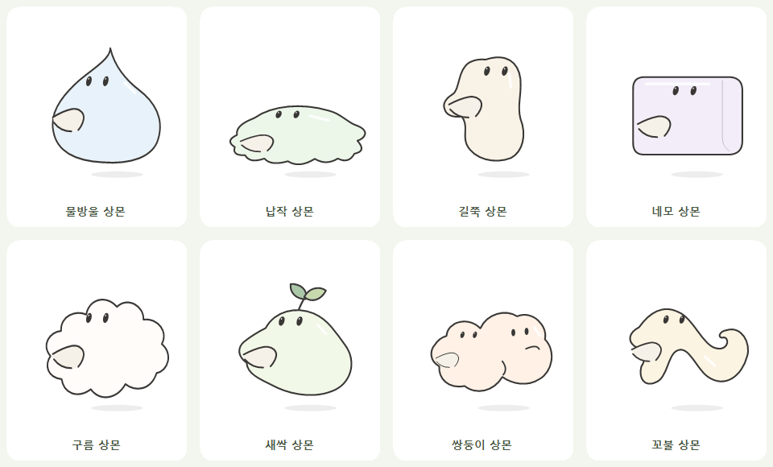

# 상몬 형태 연구

2026-10-08에 슬라임의 다양한 외형을 검색하고 아래 자료를 참고했습니다.

- [Slime Rancher 2 공식 미디어](https://www.slimerancher.com/media/): 유기적인 덩어리와 말랑하게 변형되는 캐릭터를 관찰했습니다.
- [Minecraft 공식 Slime 소개](https://www.minecraft.net/en-us/article/slime): 각진 덩어리, 부피 차이, 튀는 움직임을 참고했습니다.
- [Slime Character Set — Pikepicture](https://designbundles.net/pikepicture/3942363-slime-character-set-cartoon-vector-illustration): 여러 윤곽과 표정을 비교하는 참고 자료입니다.

참고 이미지를 앱에 넣지 않고 새 윤곽을 C#의 벡터 경로로 작성했습니다. 상몬의 검은 선, 두 눈, 옆으로 나온 입을 얼굴의 공통 특징으로 유지합니다. 기존 8종의 저장 ID는 유지하고 새 ID를 뒤에 추가했습니다.

| 추가 형태 | 윤곽과 움직임 |
| --- | --- |
| 물방울 | 꼭대기가 휘는 물방울 몸, 통통 튀기 |
| 납작 | 바닥으로 퍼진 물웅덩이, 가장자리 흔들림, 느린 이동 |
| 길쭉 | 세로로 늘어난 말랑한 몸 |
| 네모 | 모서리가 둥근 젤리 블록, 눌렸다 펴지는 움직임 |
| 구름 | 여러 둥근 덩어리가 이어진 몸 |
| 새싹 | 작은 잎이 달린 배 모양의 몸 |
| 쌍둥이 | 크기가 다른 두 덩어리와 두 얼굴 |
| 꼬불 | 길게 이어져 안쪽으로 말리는 몸과 꼬리 |

색은 옅은 파스텔로 구분하고 흰 반사선을 더했습니다. 평소에는 불꽃을 표시하지 않으며, 터치와 드문 하품에만 잠깐 불을 뿜습니다. 하품 때 별도의 동그란 입을 만들지 않습니다.

형태 코드는 `windows/Character/SlimeForms.cs`, 이름·ID·이동 속도는 `MonsterVariants.cs`에서 수정합니다. 얼굴과 불꽃 위치는 같은 배치 변환을 사용합니다.

