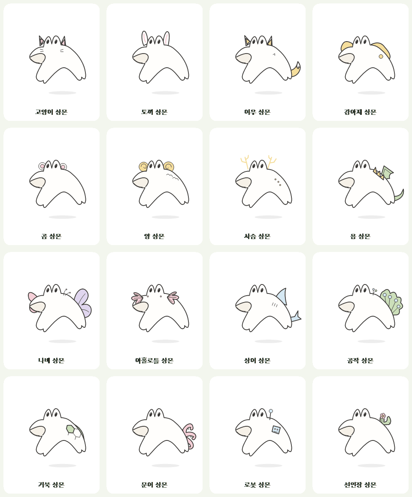

# 상몬 외형 디자인

상몬의 기본 형태 위에 특징을 덧붙입니다. 두 눈이 솟은 머리, 옆으로 나온 입, 아치형 몸과 발, 검은 스케치 선과 밝은 몸색을 공통 기준으로 삼습니다. 몸을 물방울이나 네모로 교체하지 않습니다.

기존 참고 스케치 8종은 유지하고, 같은 기본 몸과 얼굴에 신체 요소 또는 장식을 추가한 40종을 제공합니다. 추가 외형은 기본 몸의 뒤와 앞에 그리는 두 레이어로 분리합니다. 눈·입의 위치와 발 사이의 빈 공간을 유지합니다. 걷기·늘어남·눈 깜박임·불꽃 반응은 공통 렌더러를 사용하며 지느러미·꼬리·날개·목도리·긴 귀·아가미에는 작은 흔들림을 더합니다.

| 그룹 | 버전 |
| --- | --- |
| 기존 스케치 8종 | 기본, 빵빵, 날개, 쌩쌩, 멍한, 삐죽, 뿔, 꼬마 |
| 신체·자연 외형 8종 | 지느러미, 등껍질, 꼬리, 수정, 복슬, 새싹, 꽃, 리본 |
| 테마·장비 8종 | 천사, 악마, 왕관, 마법사, 해적, 우주, 헤드폰, 안경 |
| 생활·상징 8종 | 목도리, 배낭, 잠옷, 우비, 겨울, 별, 달, 하트 |
| 귀·뿔·꼬리 8종 | 고양이, 토끼, 여우, 강아지, 곰, 양, 사슴, 용 |
| 날개·아가미·등 장식 8종 | 나비, 아홀로틀, 상어, 공작, 거북, 문어, 로봇, 선인장 |

총 48종입니다. 색은 추가 요소에만 옅은 파스텔로 적용하며 기본 몸은 밝은 스케치 톤을 유지합니다. 평소에는 불꽃이 없으며 터치와 드문 하품에만 잠깐 불을 뿜습니다. 하품에 별도의 동그란 입을 만들지 않습니다.

## 팀에서 수정하는 위치

- `windows/Character/MonsterPainter.cs`: 공통 몸, 얼굴, 포즈와 불꽃
- `windows/Character/MonsterAdditions.cs`: 추가 외형의 뒤/앞 레이어
- `windows/Character/MonsterVariants.cs`: 48종 이름, 저장 ID와 이동 속도

새 외형을 수정할 때 원형의 몸 경로나 눈·입 좌표를 바꾸지 않고 뒤/앞 레이어를 편집합니다. 투명 창 가장자리와 양쪽 방향의 움직임, 눈과 발 사이 빈 공간은 테스트에서 확인합니다. 일기 선택 메뉴와 바탕화면 우클릭 메뉴는 같은 버전 목록을 사용합니다.

기존 첫 8종의 저장 ID와 순서는 유지합니다. 잠시 제공했던 슬라임 형태의 ID `droplet/puddle/pill/cube/cloud/twin`은 `fin/shell/tailed/crystal/furry/flower`로 읽고 다음 저장부터 새 ID로 보관합니다. `sprout/ribbon`은 같은 ID로 수정된 상몬 외형을 사용합니다. 일기 내용은 유지합니다.
새 16종은 기존 32종 뒤에 추가해 이전 선택 ID와 메뉴 순서도 유지합니다.

## 참고 자료

2026-10-08에 [Slime Rancher 공식 미디어](https://www.slimerancher.com/media/), [Minecraft 공식 Slime 소개](https://www.minecraft.net/en-us/article/slime), [Pikepicture의 Slime Character Set](https://designbundles.net/pikepicture/3942363-slime-character-set-cartoon-vector-illustration)을 살펴봤습니다. 여러 캐릭터를 구분하는 부속 요소와 움직임을 참고하며, 상몬의 몸과 얼굴은 사용자가 제공한 원래 스케치를 기준으로 합니다. 외부 게임 이미지를 앱에 넣지 않고 C# 벡터 경로로 외형을 그립니다.

