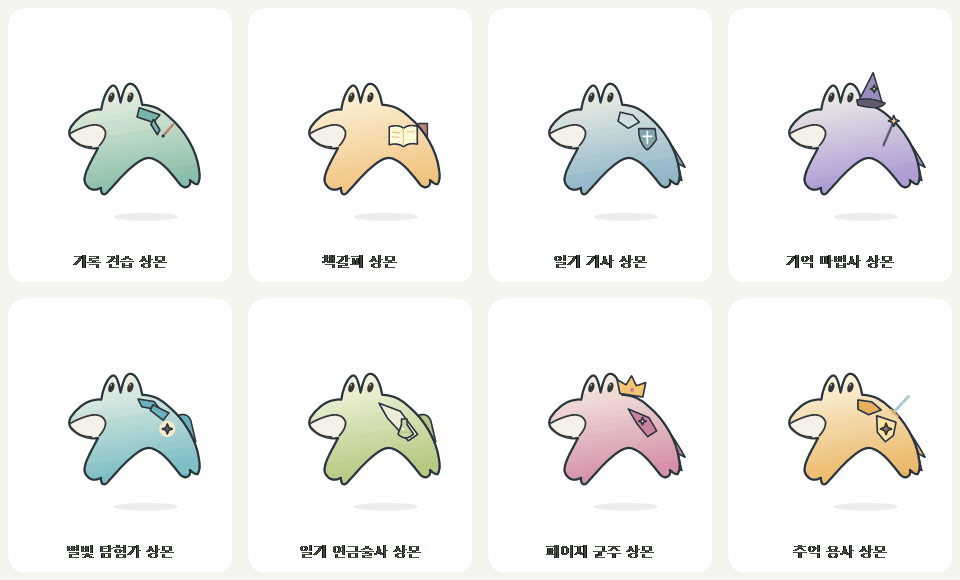

# 상몬 성장과 보상 외형

Windows v0.3.8-preview부터 일기를 기록하며 상몬을 키울 수 있습니다. 왼쪽 **성장 보기** 또는 바탕화면 상몬 우클릭 → **상몬 성장**에서 레벨·경험치·다음 보상을 확인하고 해금한 모습을 장착합니다. 알림 영역 MyDay 메뉴에서도 열 수 있습니다.

## 경험치 규칙

- 글·사진 설명·감정 내용을 입력하거나 수정하고 저장하면 **하루 +10 XP**를 받습니다. 실제 사진 추가·교체, 할 일 또는 습관 완료도 기록으로 인정합니다.
- **실제로 저장한 컴퓨터의 현지 날짜**를 기준으로 하루 한 번 지급합니다. 같은 날 여러 날짜의 일기를 쓰거나 여러 번 고쳐도 추가 지급하지 않습니다.
- 빈 템플릿·빈 사진 자리 추가, 배경·기분·배치 변경, 캐릭터 선택, 백업 가져오기는 경험치를 주지 않습니다. 이미 쓰인 내용만 그대로 다시 저장해도 지급하지 않습니다.
- **50 XP마다 레벨 업**합니다. Lv.1에서 시작하며 5일 기록하면 Lv.2, 45일이면 Lv.10입니다. 레벨이 올라가면 상몬이 잠깐 통통 뛰며 저장 안내에 새 레벨을 표시합니다.
- 쉬는 날에도 경험치는 유지합니다. 일기를 지우거나 고쳐도 이미 받은 경험치를 차감하지 않습니다. 마지막 보상을 받은 뒤에도 경험치와 레벨은 쌓입니다.
- 기존 일기에서 지난 경험치를 자동 계산하지 않습니다. 이번 버전에서 새로 기록하는 활동부터 지급합니다.

## 추가 성장 외형 8종

기존 **56종은 계속 자유롭게 선택**할 수 있습니다. 다음 외형만 새 성장 보상입니다. 원래 상몬의 두 눈·옆입·아치형 몸을 유지하고 의상과 소품을 더했습니다.

| 해금 | 누적 기록일 | 모습 | 추가 외형 |
| --- | --- | --- | --- |
| Lv.2 | 5일 | 기록 견습 상몬 | 청록 목도리와 연필 |
| Lv.3 | 10일 | 책갈피 상몬 | 열린 책과 붉은 책갈피 |
| Lv.4 | 15일 | 일기 기사 상몬 | 어깨 갑옷·방패·망토 |
| Lv.5 | 20일 | 기억 마법사 상몬 | 별 모자·지팡이·망토 |
| Lv.6 | 25일 | 별빛 탐험가 상몬 | 탐험 목도리·나침반·배낭 |
| Lv.7 | 30일 | 일기 연금술사 상몬 | 앞치마·초록 물약·가방 |
| Lv.8 | 35일 | 페이지 군주 상몬 | 왕관·보석 장식·망토 |
| Lv.10 | 45일 | 추억 용사 상몬 | 황금 갑옷·별 방패·검 |

총 **64종**입니다. 성장 화면의 **이 모습으로 함께하기**를 누르면 일기 속 상몬과 바탕화면 상몬에 함께 적용하고 재실행해도 유지합니다. 잠긴 외형은 그림과 필요 레벨을 미리 볼 수 있고 선택 메뉴에서는 비활성화됩니다. 성장 연출은 불꽃을 계속 뿜게 하지 않으며 기존 터치·드문 하품 반응을 유지합니다.

## 저장과 백업

경험치를 받은 날짜만 일기 파일의 `Progress.AwardedDays`에 보관하고 경험치·레벨은 여기서 계산합니다. 성공적으로 저장한 경우에만 지급하며 디스크 저장에 실패하면 성장 기록을 되돌리고 재시도합니다.

**기록 백업**에 성장 기록도 포함합니다. **가져오기**에서는 현재와 백업의 지급 날짜를 합치고 같은 날짜는 한 번만 계산합니다. 성장 기록이 없는 옛 백업도 현재 경험치를 지우지 않습니다. 일기의 같은 날짜 본문을 백업으로 바꾸는 규칙은 기존과 같습니다.

성장 기록을 저장하면 파일은 **버전 3** 형식이 됩니다. **v0.3.8-preview 이상**으로 열어주세요. 버전 1·2 일기와 백업도 읽을 수 있으며 글·사진·레이아웃을 유지합니다. 기존 앱이 새 성장 필드를 지우며 저장하는 일을 막기 위한 형식 변경입니다. 성장 날짜는 최대 50,000개를 보관합니다.

## 공동 작업 파일

| 영역 | 파일 |
| --- | --- |
| 경험치·레벨·보상 조건·활동 비교·백업 병합 | `windows/Core/SangmonGrowth.cs` |
| 일기 형식 버전과 성장 저장 검증 | `windows/Core/DiaryData.cs` |
| 성장 화면·카드·장착 버튼 | `windows/UI/GrowthWindow.cs` |
| 일기/바탕화면 연결·장착·격리된 화면 검증 | `windows/UI/DiaryWindow.Growth.cs` |
| 자동 저장과 경험치의 동시 커밋 | `windows/UI/DiaryWindow.cs` |
| 보상 의상·색·소품 | `windows/Character/RewardSkins.cs` |
| 이름과 저장 ID | `windows/Character/MonsterVariants.cs` |
| 바탕화면 메뉴 잠금과 레벨 업 동작 | `windows/Character/DesktopPet.cs` |
| 성장 단위 검증 | `windows/GrowthTests.cs` |

현재 Windows에 적용했습니다. Android와 성장/일기 기록을 자동 동기화하지 않습니다. 화면과 애니메이션 예시는 격리된 가상 기록으로 만들었습니다.
