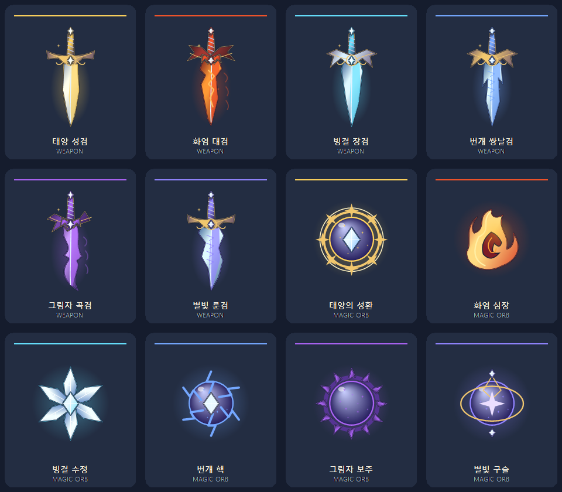
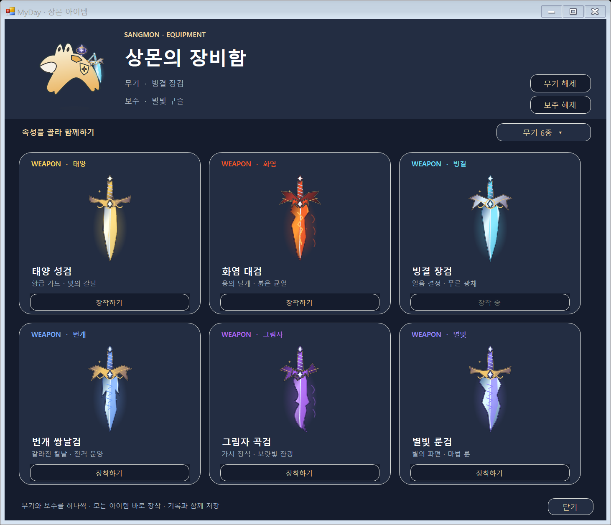
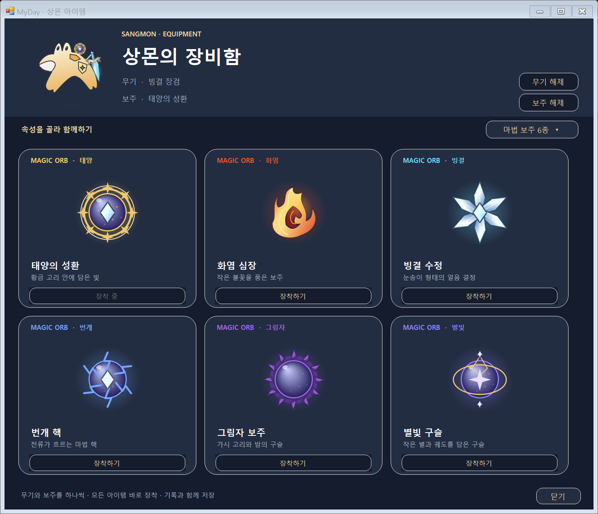

# 상몬 아이템과 장비함

Windows v0.3.9-preview에서 검 6종과 마법 보주 6종을 추가했습니다. 참고 이미지의 속성별 색·보석·금속 명암을 바탕으로 C# 벡터 경로로 제작했습니다. 총 12종을 모두 바로 선택할 수 있습니다.

## 장착하기

일기 왼쪽 **아이템** 또는 바탕화면 상몬 우클릭 → **아이템 장착**으로 장비함을 엽니다. 알림 영역 MyDay 메뉴에서도 열 수 있습니다.

**무기 6종 / 마법 보주 6종 / 전체 12종**에서 모습을 살펴보고 **장착하기**를 누릅니다. 검과 보주를 각각 하나씩 함께 장착하며 한 슬롯의 아이템을 바꾸면 다른 슬롯은 유지합니다. **무기 해제 / 보주 해제**로 각각 벗길 수 있습니다.

일기 속 상몬과 바탕화면 상몬에 같은 장비가 표시됩니다. 장비는 날짜와 상몬 외형에 관계없이 유지되고 앱을 다시 열어도 남습니다. 보주는 상몬 옆에 떠 있고 검과 함께 작은 흔들림과 빛의 변화를 표시합니다. 상몬의 두 눈·옆입·몸과 움직임은 유지합니다.

현재 아이템은 상몬을 꾸미는 장비입니다. 전투 능력치·구매·랜덤 뽑기는 없으며 장비를 바꾸는 것만으로 경험치를 받지 않습니다.

## 아이템 목록

| 속성 | 검 | 마법 보주 | 특징 |
| --- | --- | --- | --- |
| 태양 | 태양 성검 | 태양의 성환 | 황금 가드·빛의 칼날·황금 고리 |
| 화염 | 화염 대검 | 화염 심장 | 용 날개 모양·붉은 균열·불꽃 코어 |
| 빙결 | 빙결 장검 | 빙결 수정 | 푸른 결정 면·얼음 광채·눈송이 |
| 번개 | 번개 쌍날검 | 번개 핵 | 갈라진 칼날·전격 문양·마법 핵 |
| 그림자 | 그림자 곡검 | 그림자 보주 | 굽은 칼날·가시·보랏빛 고리 |
| 별빛 | 별빛 룬검 | 별빛 구슬 | 별의 파편·마법 룬·궤도와 보석 |

## 저장과 백업

선택한 장비를 `Equipment.WeaponId`와 `Equipment.CharmId`에 보관합니다. 성공적으로 저장한 뒤 화면에 적용하며 실패하면 기존 장비와 버전을 복구합니다. 먼저 아직 저장하지 않은 일기를 저장하므로 장착 중에도 글·사진을 보존합니다.

**기록 백업**에 장비도 포함합니다. 장비 정보가 있는 백업을 가져오면 그 백업의 두 슬롯을 복원합니다. 장비 정보가 없는 옛 백업은 현재 장비를 유지합니다. 알 수 없는 아이템이나 잘못된 슬롯은 해당 장비를 해제한 상태로 읽고 일기를 유지합니다.

장비를 저장한 기록은 **버전 4** 형식이며 **v0.3.9-preview 이상**에서 열어주세요. 이전 버전 1·2·3 일기와 백업도 읽습니다. 기존 성장 기록·내 레이아웃·본문·사진을 보존하며 새 필드를 지우는 옛 앱의 저장을 막습니다. 장비를 해제해도 파일 형식 버전을 낮추지 않습니다.

## 공동 작업 파일

| 영역 | 파일 |
| --- | --- |
| 12종 이름·ID·슬롯·속성·장착·백업 | `windows/Core/SangmonItems.cs` |
| 검·보주 도형·명암·광채·상몬 옆 배치 | `windows/Character/ItemPainter.cs` |
| 장비함·분류·장착/해제·선택 상태 | `windows/UI/EquipmentWindow.cs` |
| 움직이는 아이템 미리보기 | `windows/UI/ItemView.cs` |
| 일기·바탕화면 연결·저장 복구·화면 검증 | `windows/UI/DiaryWindow.Items.cs` |
| 기록 버전 4와 저장 | `windows/Core/DiaryData.cs` |
| 모델·저장·모든 조합의 그림 경계 검증 | `windows/ItemTests.cs` |

`--item-preview`로 네이티브 아이템 렌더링 프레임을 만들고 `tools/package-preview.py`로 GIF를 묶습니다. 화면 예시는 개인 기록을 쓰지 않는 격리된 테스트 창에서 만들었습니다. 장비 기능은 현재 Windows에 적용했습니다.
