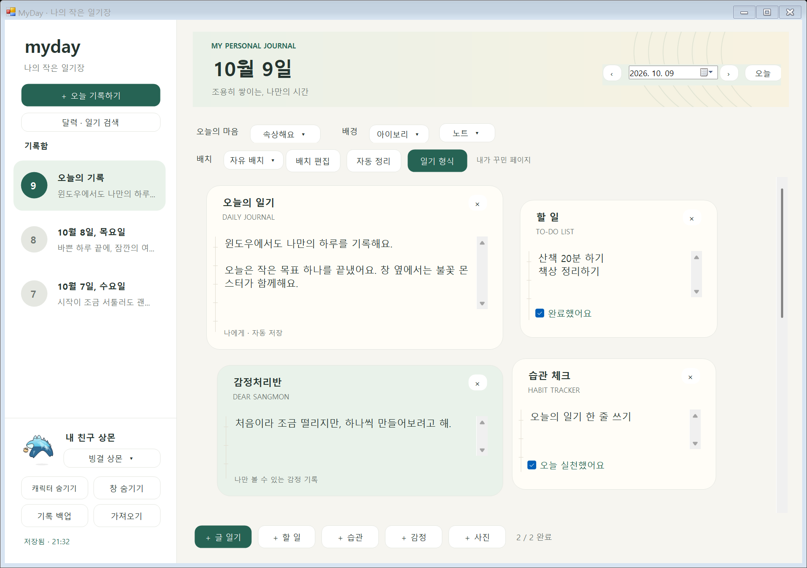
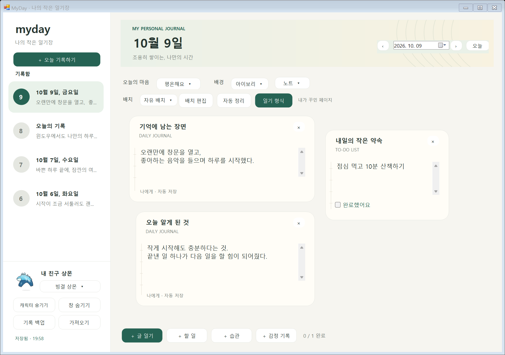
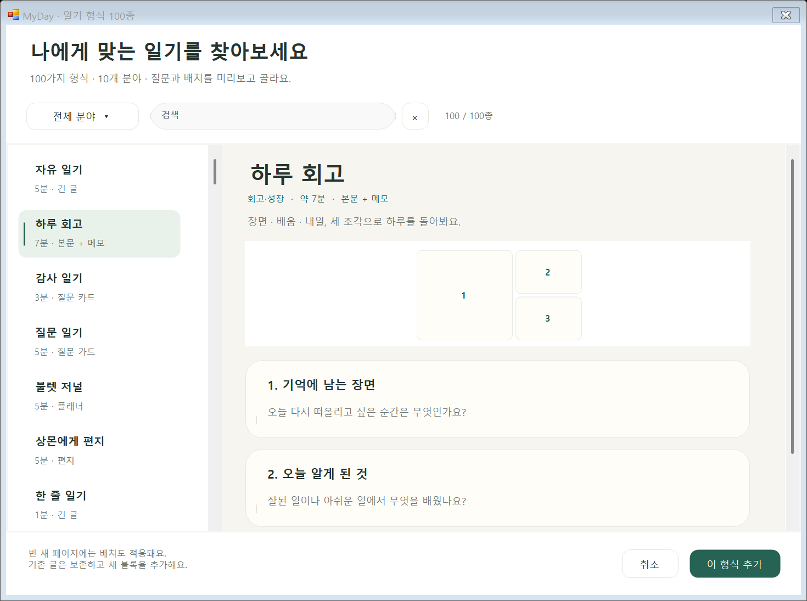

# Windows 일기 디자인

날짜별 기록 목록과 넓은 작성 공간에 아이보리 종이·차분한 청록색을 적용했습니다. 날짜 표지, 작은 상몬 프로필, 둥근 일기 블록을 사용합니다. 왼쪽 기록함을 클릭해 날짜를 바꾸고, 아래쪽 버튼으로 블록을 추가합니다. **일기 형식**에서 100종을 검색·분야별로 탐색하고 질문과 배치를 미리봅니다.

| 바꾸려는 내용 | 파일 |
| --- | --- |
| 색·글꼴·둥근 버튼·카드 | `windows/UI/Design.cs` |
| 기록함·날짜 헤더·도구·상몬 프로필 배치 | `windows/UI/DiaryWindow.cs` |
| 날짜 표지의 색과 장식 | `windows/UI/JournalCover.cs` |
| 날짜 행·선택 강조·본문 미리보기 | `windows/UI/HistoryRow.cs` |
| 달력·검색 창·검색칸·결과 목록 | `windows/UI/JournalBrowser.cs` |
| 월간 달력·기록/사진 표시 | `windows/UI/MonthCalendar.cs` |
| 블록 제목·본문·체크·편집 도구 | `windows/UI/BlockCard.cs` |
| 자유 배치와 드래그 입력 | `windows/UI/DiaryBoard.cs` |
| 형식 선택·미리보기 화면 | `windows/UI/TemplateGallery.cs` |
| 기존 형식·검색·추가 | `windows/Core/DiaryTemplates.cs` |
| 분야별 제목·질문·출처 | `windows/Core/Templates/` |
| 형식별 8종 배치 | `windows/Core/JournalLayouts.cs` |
| 형식 행과 배치 그림 | `windows/UI/TemplateOption.cs` |

색상은 `Design.Ink`, `Muted`, `Accent`, `Soft`, `Tint`, `Paper`, `Backgrounds`에서 바꿉니다. 배경은 아이보리·화이트·미스트, 블록 표면은 노트·카드·도트를 고릅니다. 노트와 도트의 표시가 본문 옆 여백에 나타납니다. 본문은 기존 Windows 텍스트 입력 컨트롤입니다. 간격·크기는 `Design.P/Point/Size/Pad`로 Windows 배율에 맞춥니다.

기록함에는 저장된 날짜와 오늘·현재 선택 날짜가 나타납니다. 글 일기 내용을 먼저 미리보고, 없으면 다른 블록의 내용을 표시합니다. 본문 미리보기는 120자, 한 목록은 60일로 제한해 많은 기록도 나누어 탐색합니다. 날짜 선택은 해당 목록을 자동으로 엽니다.

[달력 · 일기 검색](CALENDAR-SEARCH.md)은 왼쪽 버튼이나 Ctrl+F로 엽니다. 달력과 검색 결과를 나란히 배치하고 기록한 날·사진 있는 날을 표시합니다. 검색어가 없으면 현재 달의 목록, 입력하면 전체 날짜의 본문과 사진 설명을 최신순으로 표시합니다. 결과는 페이지당 50일이며 일치하는 부분을 짧게 미리봅니다. 작은 창에서는 결과 폭과 달력 높이를 조정합니다.

기존 저장본은 원래 블록 구성과 자유 배치를 유지합니다. 새로운 날짜는 큰 글 일기 한 칸으로 시작하며, [일기 형식 사용 안내](JOURNAL-FORMATS.md)에 따라 질문·회고·편지 형식을 추가할 수 있습니다.

참고: [Day One 템플릿](https://dayoneapp.com/features/journal-templates/)의 형식 선택, [Diarium](https://diariumapp.com/en)의 날짜 중심 화면, [Notion Daily Journal](https://www.notion.com/templates/daily-journal)의 여백과 섹션 구성을 살펴봤습니다. 화면 구성·질문·장식은 프로젝트에 맞춰 직접 작성했으며 외부 로고·이미지·템플릿 파일은 포함하지 않았습니다.

상몬의 게임 외형 8종·기존 48종, 클릭 반응과 바탕화면 이동은 [상몬 디자인](SANGMON-DESIGN.md)에서 관리합니다. 감정 블록은 개인 기록이며 메시지를 전송하거나 AI 답변을 생성하지 않습니다.

검증은 `windows/build.ps1`, `MyDay.exe --self-test`, `MyDay.exe --smoke-test windows/test-output`으로 실행합니다. 네이티브 화면 검증은 격리된 예시 데이터로 날짜 목록 클릭·날짜 이동·자동 저장·드래그·크기 변경·작은 창·캐릭터 메뉴를 확인하고 PNG를 생성합니다.

