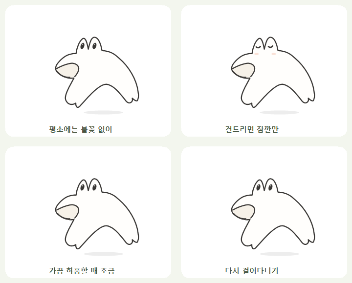
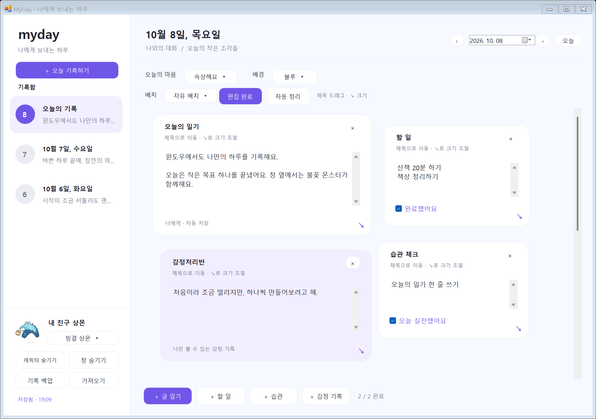
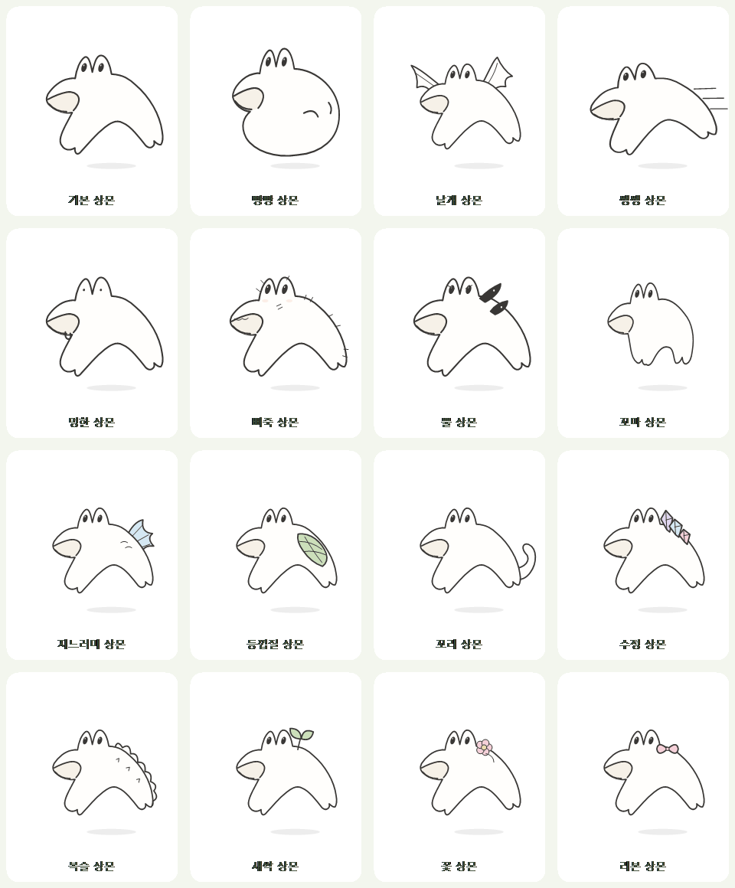
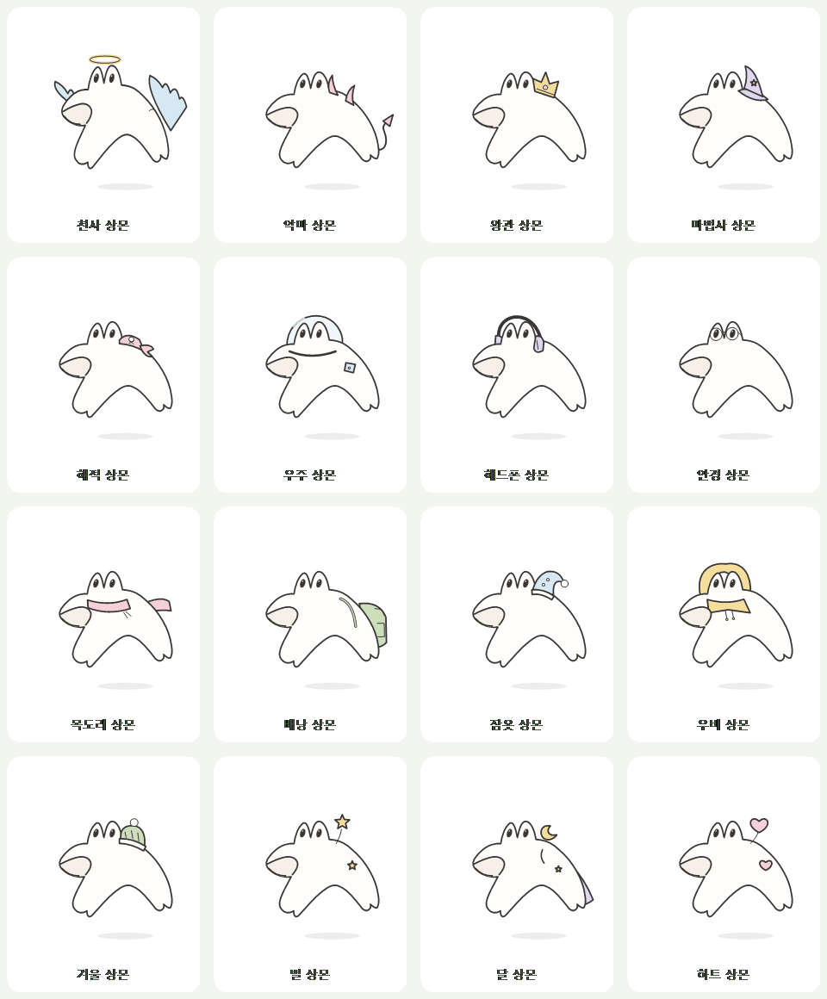
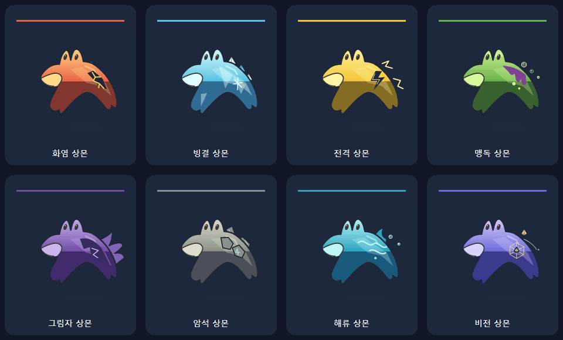

# MyDay Windows

Windows에서 실행하는 C# / Windows Forms 일기 앱과 투명한 바탕화면 캐릭터입니다.
Android 프로젝트와 별도 폴더에서 개발하며 외부 패키지, 브라우저, Node.js가 필요하지 않습니다.

## 실행

Windows 10/11과 .NET Framework 4.8 이상을 사용합니다.
`실행.cmd`를 더블클릭하면 처음에는 소스를 빌드한 뒤 바탕화면에 캐릭터가 나타납니다.
캐릭터를 한 번 클릭하면 일기 창이 열립니다.
빌드 후에는 `bin/MyDay.exe`만 더블클릭해도 실행할 수 있습니다.
GitHub CI의 Windows artifact에서도 실행 파일을 받을 수 있습니다.
[다운로드용 Windows ZIP](https://github.com/parkhookjung-debug/myday-diary/releases/tag/v0.3.2-preview)은 압축을 풀고 `MyDay.exe`를 실행합니다.

## 기능

- DM 스타일 기록함: 날짜별 목록·본문 미리보기·현재 날짜 강조, 목록 클릭으로 기록 이동
- 보라색 포인트, 둥근 버튼·카드, 작은 상몬 프로필과 아래쪽 블록 추가 버튼. [디자인 변경 안내](../docs/WINDOWS-DESIGN.md)
- 날짜별 글 일기, 할 일, 습관 체크, 감정 기록
- 블록 추가, 순서 이동, 너비 변경, 삭제 확인
- 자유 배치: 제목을 잡아 드래그 이동, 오른쪽 아래 ↘로 크기 조절, 날짜별 위치·크기 저장
- 배경 테마 3종과 오늘의 마음 기록
- 입력 후 자동 저장, 날짜 이동·종료 전 저장 확인
- JSON 백업과 가져오기 (같은 날짜는 확인 후 교체)
- 투명한 불꽃 몬스터: 자유로운 방향 전환, 경계 반사, 눈 깜박임, 숨 쉬기, 클릭 시 일기 열기, 드래그
- 걷기·통통 뛰기·두리번거리기·쉬기·짧은 졸기 사이를 전환하며, 몸 눌림·늘어남·기울임과 눈빛·불티를 표현
- 마우스가 가까이 오면 멈춰 바라보고, 드래그 후 내려놓으면 가볍게 통통 튀는 반응
- 평소에는 불꽃이 없고, 클릭하거나 내려놓으면 약 0.7초만 불을 뿜습니다. 가끔 하품하며 약 0.35초 동안 작은 불꽃이 나오고, 자동 하품은 최소 30초 간격입니다.
- 상몬 48종: 기존 스케치 8종과, 기본 몸·두 눈이 솟은 머리·옆입·발 사이 아치를 유지하며 외형을 덧붙인 40종을 제공합니다. 자연·테마·장비 외형에 고양이·토끼·여우·강아지·곰·양·사슴·용·나비·아홀로틀·상어·공작·거북·문어·로봇·선인장 16종을 추가했습니다. 전체 목록은 [상몬 외형 디자인](../docs/SANGMON-DESIGN.md)에서 확인할 수 있습니다.
- 게임 스타일 8종: 화염·빙결·전격·맹독·그림자·암석·해류·비전. 원래 상몬 몸과 얼굴에 선명한 색, 단계가 나뉜 명암, 재질 문양과 움직이는 속성 효과를 적용합니다. 기존 외형과 합쳐 총 56종입니다. 캐릭터 우클릭 → **게임 스타일**에서 바로 선택할 수 있습니다.
- 캐릭터 우클릭: 일기 열기, 이동 켜기/끄기, 다른 창 위에 표시, 불 뿜기, 숨기기
- 알림 영역 아이콘: 일기 열기, 캐릭터 표시/숨기기, 모두 종료

일기 창의 X는 기록을 저장한 뒤 창만 숨깁니다. 캐릭터는 계속 움직이며 다시 한 번 클릭하면 일기를 열 수 있습니다.
알림 영역의 **모두 종료**는 앱과 캐릭터를 함께 종료합니다. 캐릭터 클릭은 짧은 불꽃 반응과 함께 일기를 열고, 우클릭 메뉴나 일기 안의 몬스터에서도 잠깐 불을 뿜게 할 수 있습니다. 마우스를 가까이 대기만 할 때는 불을 뿜지 않습니다.
감정 기록은 일기 저장 기능이며 AI 대화는 없습니다.
[자유 배치 사용·개발 안내](../docs/FREE-LAYOUT.md): 위쪽 **배치 편집**을 누르고 제목으로 이동하거나 ↘로 크기를 바꾼 뒤 **편집 완료**로 글 입력을 다시 켭니다. **자동 정리**는 블록을 겹치지 않게 배치합니다. **자동 정렬**로 전환했다가 자유 배치로 돌아와도 저장된 위치를 유지합니다.
일기 왼쪽 캐릭터 아래 선택 메뉴 또는 캐릭터 우클릭 → **캐릭터 버전**에서 모습을 바꿉니다. 앱과 바탕화면에 함께 적용하며 재실행해도 선택을 유지합니다. 캐릭터 선택은 날짜별이 아닌 앱 전체 설정입니다.
이 버전의 캐릭터는 Windows 위에 뜨는 투명 창입니다. Windows 배경화면을 교체하지 않습니다.
Android 기록과 자동 동기화하지 않습니다. 사진·영상·시작 시 자동 실행은 아직 추가하지 않았습니다.

## 기록 위치

`%LOCALAPPDATA%/MyDay/Windows/diary.json`에 보관합니다. 프로그램 폴더를 옮겨도 같은 Windows 계정의 기록을 유지합니다.
이전 저장본은 `diary.json.bak`에 남습니다. 기록을 수정하거나 PC를 옮기기 전 **기록 백업**으로 별도 파일을 보관하세요.
손상된 기록을 읽지 못하면 앱이 오류를 표시하고 종료하며 빈 기록으로 덮어쓰지 않습니다.

## 팀 디자인·기능 수정

| 영역 | 파일 |
| --- | --- |
| 색상·글꼴·버튼·카드 | `UI/Design.cs` |
| 일기 창 배치·날짜·연결 | `UI/DiaryWindow.cs` |
| 날짜별 기록 목록의 표시 | `UI/HistoryRow.cs` |
| 자유 캔버스·드래그·리사이즈 핸들 | `UI/DiaryBoard.cs` |
| 일기 블록 UI | `UI/BlockCard.cs` |
| 기록 모델·검증·저장·백업 | `Core/DiaryData.cs` |
| 논리 좌표·자동 정렬·크기 범위 | `Core/DiaryLayout.cs` |
| 스케치 캐릭터 그림·포즈 | `Character/MonsterPainter.cs` |
| 캐릭터 버전 ID·이름 | `Character/MonsterVariants.cs` |
| 원형을 유지하는 추가 외형·장식 | `Character/MonsterAdditions.cs` |
| RPG 속성 색상·명암·재질·효과 | `Character/GameSkins.cs` |
| 행동 전환·가속·반응 | `Character/PetBehavior.cs` |
| 바탕화면 이동·드래그·투명 창 | `Character/DesktopPet.cs` |
| 앱 안의 캐릭터 | `UI/MonsterView.cs` |

캐릭터는 Android 버전과 같은 스케치 좌표를 사용하지만 플랫폼별 렌더링 코드로 관리합니다. 생동감 있는 추가 행동은 현재 Windows 버전에 적용했습니다.












참고 자료와 새 형태의 특징은 [상몬 형태 연구](../docs/SANGMON-DESIGN.md)에 정리했습니다.

참고 사진의 게시물 화면·계정 정보는 저장소에 포함하지 않고 캐릭터를 코드로 그렸습니다. 이전 기록 파일에 캐릭터 설정이 없으면 기본형을 사용합니다.
잠시 제공했던 물방울·납작·길쭉·네모·구름·쌍둥이 선택은 지느러미·등껍질·꼬리·수정·복슬·꽃 버전으로 읽습니다. 기록 내용은 유지하며 다음 저장부터 새 ID를 사용합니다.

## 빌드 및 확인

```powershell
powershell -NoProfile -ExecutionPolicy Bypass -File windows/build.ps1
$process = Start-Process windows/bin/MyDay.exe -ArgumentList '--self-test' -Wait -PassThru -WindowStyle Hidden
if ($process.ExitCode -ne 0) { throw 'Tests failed' }
```

자동 테스트는 실제 기록과 분리된 임시 폴더에서 저장 보존·날짜 분리·백업·손상 파일 처리·애니메이션을 확인합니다.
`--smoke-test <출력 폴더>`는 격리된 예시 데이터로 입력·체크·순서 이동·날짜 이동·재로드와 네이티브 투명 창을 확인하고 PNG를 만듭니다.
다중 모니터·고배율 DPI·절전 복귀·우클릭 메뉴·드래그는 실제 사용 환경에서도 확인해주세요.

기반 기술: [Microsoft Windows Forms](https://learn.microsoft.com/en-us/dotnet/desktop/winforms/overview/), [UpdateLayeredWindow](https://learn.microsoft.com/en-us/windows/win32/api/winuser/nf-winuser-updatelayeredwindow).
